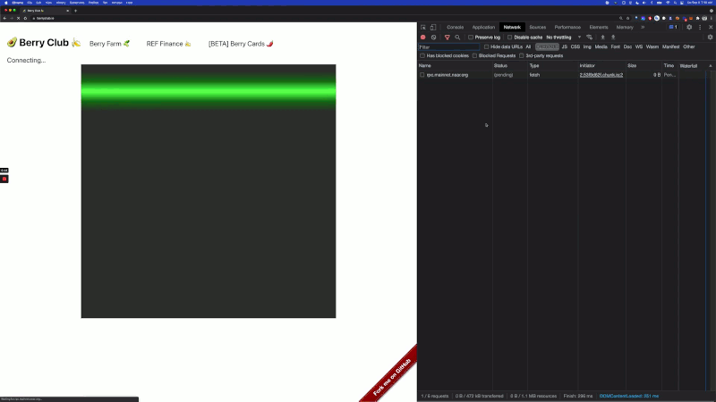

# How to build a Play To Earn game on Near
#### In depth review of the current prototype - BerryClub
### This article was written to apply for the Near-Dev partner challenge of the Near Metabuidl Hackathon all info [here](https://airtable.com/shrdNEynK25TGJ91h/tblTtriXzrEiCfpoy)

This guide is meant to let you understand the basic dynamics that will enable you to create a play to earn game on Near Protocol.

We don’t mean to make you or your players rich, but the mechanics of Near work in such a way for small transactions to be very useful on a simple HTML5 UI and create a simple and fun farming game.

We will analyze a smart contract and the js/rust files behind an existing farming game, [berryclub](https://berryclub.io/).
If you apply the very same logic to your ideas of game you may get even funnier results!

To follow the technical side of this tutorial we highly recommend checking the figment Near Pathway to [build a transaction](https://learn.figment.io/tutorials/transfer-near-tokens) and [build your first smart contract on Near](https://learn.figment.io/tutorials/deploy-near-contract), the concepts present in that guides are not included in this tutorial.
It will be far easier fo you to follow this tutorial if you keep a tab open on the linked source file while reading the explanation, because much of the mentioned code is referenced with line numbers but not reproduced here.
The BerryClub original repo was forked for this tutorial in order to keep this effort valid as far as the code still works on the blockchain; as you will see in the next section the game itself has evolved thourgh time and will be evolving again, we wanted to make a point of it's state right now.

# The Berryclub frontend

Berryclub is built with React, so the very first thing we’ll step into in the [app.js file](https://github.com/jilt/Near-Dev-how-to/blob/master/frontend/src/App.js) located into the src folder of the github repo, this will save us time in analysing the contract letting us focus on what we need to extrapolate the logic outside of the actual game (which is fun and played by a big community btw).

```
import React from "react";
import BN from "bn.js";
import * as nearAPI from "near-api-js";
import { AlphaPicker, HuePicker, GithubPicker } from "react-color";
import Switch from "react-switch";
import { Weapons } from "./Weapons";
import Timer from "react-compound-timer";
```
After importing react the first library needed is [bn.js](https://www.npmjs.com/package/bn.js?activeTab=readme) a simple utility to manage integers or non decimal numbers, many features can come to your interface with this library, first of all here it is used to manage the transactions:

`const PixelPrice = new BN("10000000000000000000000");`

The berryclub game is based on real estate economics, there is a board managed by a part of the contract called board.rs, it is subdivided in pixels, and each pixel has a price which has to be paid in order to draw on it. The machanics of the "draw" action are the core of the Farming and self substaining abilities of the game and will be analysed in depth when we get to the smart contract.

As you can see here the single pixel price is declared as a constant at the very start of our application, and may be modified using the frontend tools and the bn.j library.
The second import is the near sdk which allows us to interact with the Near blockchain as explained in the [Figment near pathway](https://learn.figment.io/pathways/near-pathway).
The first usage of the near api is to declare the used contract variables and to ensure that the mainnet is used when code is run from the berryclub url:
```
const IsMainnet = window.location.hostname === "berryclub.io";
const TestNearConfig = {
  networkId: "testnet",
  nodeUrl: "https://rpc.testnet.near.org",
  contractName: "berryclub.testnet",
  walletUrl: "https://wallet.testnet.near.org",
};
const MainNearConfig = {
  networkId: "mainnet",
  nodeUrl: "https://rpc.mainnet.near.org",
  contractName: "berryclub.ek.near",
  walletUrl: "https://wallet.near.org",
};
const NearConfig = IsMainnet ? MainNearConfig : TestNearConfig;
```

Then we import the react UI utilities to build our interface and allow people to draw, [react-color](https://www.npmjs.com/package/react-color), [react-switch](https://www.npmjs.com/package/react-switch) and [react-compound-timer](https://volkov97.github.io/react-compound-timer/).
The first of these utlitities that’s used is the timer, it is used to set a timeout for refreshing the board on line 62.

The board "refreshing" is done by the frontend to display the updated board state using an RPC call to the smart contract.

```
const BatchTimeout = 500;
const RefreshBoardTimeout = 1000;
const MaxWorkTime = 10 * 60 * 1000;
const OneDayMs = 24 * 60 * 60 * 1000;
```

What we see here are two const more than the ones needed for refreshing, the last two in fact are used for Farming the pixels after drawing them, and set a time slot of one day to calculate the rewards.
Other const are also declared to manage the Board accordingly with the Smart contract, and here, for the first time we cross the concept of lines, wich will be very important to understand the board management and is the most reusable item of the whole interface:

```
const BoardHeight = 50;
const BoardWidth = 50;
const NumLinesPerFetch = 50;
const ExpectedLineLength = 4 + 8 * BoardWidth;

```
As you can see, after subdividing the board 50x50 we tell our interface to fetch only the lines following the `RefreshBoardTimeout` instruction and to consider the lenght of each line as the Boardwidth multiplied for 12, the size of a single cell.

```
const CellWidth = 12;
const CellHeight = 12;
const MaxNumColors = 31;
const BatchOfPixels = 100;
```
Pixels are considered in batch, not independently, both when the `draw` action is called and when the interface is refreshed.

Last but not least our imports include a custom UI component, called [Weapons,js](https://github.com/jilt/Near-Dev-how-to/blob/master/frontend/src/Weapons.js): this component has been developed later in the history of the berryclub community, in order for each user to be able to upload and draw an entire image on the board, and mint it on the [berrycards NFT marketplace](https://berry.cards/#/).

## DeFi mechanics

The lines between 27 and 51 are a useful referencee to how this Dapp builds its Farming abilities over some basic DeFi mechanics that will be analysed in the last parts of this tutorial.
By now we just briefly mention that in order to draw/buy a pixel berryclub funnels you through a couple of DeFi operations on [ref.finance](https://app.ref.finance/) using it’s own specific Tokens, avocados for buying pixels and bananas earned from the pixels you bought.


There is [a simple uniswap clone created to swap near for bananas/avocados](https://bananaswap.berryclub.io/) that worked on the same smart contract built for the other tokens of this game/prototype.
There is also a [farming token](https://farm.berryclub.io/) created for the game, called cucumber, it allows people to earn a part of the tokens that the whole community that plays the game pays for gas to draw on the board.


## The Account or how users make money

This is the very first step we make into the rust code of the smart contract, but I felt the need to remind you that DeFi mechanics aren't the only way Berryclub let's you earn tokens.
The account has [a particular file in the berryclub smart contract](https://github.com/jilt/Near-Dev-how-to/blob/master/contract-rs/pixel-board/src/account.rs) we don’t need to step into that immediately, what we need to know is that some informationinformations are collected in the account object that are crucial for the farming and earning mechanics:

- accountID
- accountIndex for the list(vector) of accounts that touched the pixel board for the last time
- balance(vector for multiple tokens owned)
- number of pixels
- claimed timestamp (nanoseconds, when the given account claimed rewards for the last time)
- farming preferences (either bananas or cucumbers)

Last two info are to calculate the rewards at a given moment, for example if you own 5 pixels for one day you acquire 5 bananas.
If you buy from someone else their earning decreases because the number of pixels they own decreases so the amount of earning get calculated and the timestamp renewed relating the new amount of owned pixels.
As we’re gonna see, the rewards are calculated based on these two variables.
The operation applied to the previous owner account when a pixel is drawn is called “touch” and you can find it in the [account.rs](https://github.com/jilt/Near-Dev-how-to/blob/master/contract-rs/pixel-board/src/account.rs) rust file.
Ownership of the single pixel unity, is the base for earning on berryclub, and in this way this mechanics are pretty much the same an NFT staking interface could use, rewarding NFT ownership.

```
pub fn touch(&mut self) -> (Berry, Balance) {
        let block_timestamp = env::block_timestamp();
        let time_diff = block_timestamp - self.claim_timestamp;
        let farm_bonus = if self.farming_preference == Berry::Avocado {
            1
        } else {
            0
        };
        let farmed = Balance::from(self.num_pixels + farm_bonus)
            * Balance::from(time_diff)
            * REWARD_PER_PIXEL_PER_NANOSEC;
        self.claim_timestamp = block_timestamp;
        self.balances[self.farming_preference as usize] += farmed;
        (self.farming_preference, farmed)
    }

```
To clear any doubts the initial owner of the board is 0, the contract itself, and whether finding a previous owner is not possible, the contract is used as the previous owner.
Finally to start up the game some tokens have been stored in the contract’s account and they are always increased using the gas price established for people to buy avocados and bananas, so that the “vault” of the game is always filled with some tokens for the users to gain.
Now let’s get back to our interface.

## Numbers to Colors and Back


The lines between 67 and 82 on [app.js](https://github.com/jilt/Near-Dev-how-to/blob/master/frontend/src/App.js) are used to decode numbers into colors and back, in order for the UI elements to interact with the board, two constant variables are definded, intToColor  and rgbaToInt.
What we can notice here is that to transform an integer number into a colour string methods are used to divide the 3 numbers for red green an blue:

```
const intToColor = (c) => `#${c.toString(16).padStart(6, "0")}`;
const intToColorWithAlpha = (c, a) =>
  `#${c.toString(16).padStart(6, "0")}${Math.round(255 * a)
    .toString(16)
    .padStart(2, "0")}`;
```

To reverse the color string into integer we simply apply a math.round() function and use the resulting integer.
```
const rgbaToInt = (cr, cg, cb, ca, bgColor) => {
  const bb = bgColor & 255;
  const bg = (bgColor >> 8) & 255;
  const br = (bgColor >> 16) & 255;

  const r = Math.round(cr * ca + br * (1 - ca));
  const g = Math.round(cg * ca + bg * (1 - ca));
  const b = Math.round(cb * ca + bb * (1 - ca));
  return (r << 16) + (g << 8) + b;
};
```
Lines below these are about uploading and printing images on the board using [the weapon component](https://github.com/jilt/Near-Dev-how-to/blob/master/frontend/src/Weapons.js) and we won’t take care of them in depth: `imgColorToInt` and `int2hsv` transform numbers into two different kinds of color scales, then `transparentColor` is defined and a gamma for the image to be printed into with `generateGamma`.
In `decodeLine` we transform the buffer in an array of pixels to be printed on the board using the above colors, iterating through them with for.

## First React constructor

In the next lines of the [app.js](https://github.com/jilt/Near-Dev-how-to/blob/master/frontend/src/App.js) we define a constructor that will define the states we will use later into our UI to interact with the blockchain.
```
class App extends React.Component {
  constructor(props) {
    super(props);
```
Using constructor and super will keep us able to use this. in the constructor.
The states defined here are the default selected color and color palette:


```
const colors = [
      "#000000",
      "#666666",
      "#aaaaaa",
      "#FFFFFF",
      "#F44E3B",
      "#D33115",
      "#9F0500",
      "#FE9200",
      "#E27300",
      "#C45100",
      "#FCDC00",
      "#FCC400",
      "#FB9E00",
      "#DBDF00",
      "#B0BC00",
      "#808900",
      "#A4DD00",
      "#68BC00",
      "#194D33",
      "#68CCCA",
      "#16A5A5",
      "#0C797D",
      "#73D8FF",
      "#009CE0",
      "#0062B1",
      "#AEA1FF",
      "#7B64FF",
      "#653294",
      "#FDA1FF",
      "#FA28FF",
      "#AB149E",
    ].map((c) => c.toLowerCase());
    // const currentColor = parseInt(colors[Math.floor(Math.random() * colors.length)].substring(1), 16);
    const currentColor = parseInt(colors[0].substring(1), 16);
    const defaultAlpha = 0.25;
```

And for the timer that refresh the board:
```
 const timeMs = new Date().getTime();
    const freeDrawingStartMsEstimated =
      timeMs -
      ((timeMs - new Date("2021-05-09")) % (7 * OneDayMs)) +
      OneDayMs * 6;
```
Then the states of the user account in use are defined, most importantly whether the user has signed in, if there are any pending transactions (defined as `pendingPixels`) the `boardLoaded` state will load the canvas board for drawing the `selectedCell` alpha and `pickerColor` states define the states of the interactive components to add colors to the board, along with `pickingColor` for picking the color from the board and `gammaColors` is useful for image printing on the board along with the `weaponsOn` and `weaponsCodePosition` states.

These other states states are useful for the account to earn on he game, pixel based and DeFi based:
```
      owners: [],
      accounts: {},
      highlightedAccountIndex: -1,
      selectedOwnerIndex: false,
      farmingBanana: false,

```
While the last three states setup the timer for later usage:
```
      freeDrawingStart: new Date(freeDrawingStartMsEstimated),
      freeDrawingEnd: new Date(freeDrawingStartMsEstimated + OneDayMs),
      watchMode: false,
```
The following list (lines 203-215) defines objects and actions that will interact with the states, referencing a DOM element for the first time, the canvas board.
```
    this._buttonDown = false;
    this._oldCounts = {};
    this._numFailedTxs = 0;
    this._balanceRefreshTimer = null;
    this.canvasRef = React.createRef();
    this._context = false;
    this._lines = false;
    this._queue = [];
    this._pendingPixels = [];
    this._refreshBoardTimer = null;
    this._sendQueueTimer = null;
    this._stopRefreshTime = new Date().getTime() + MaxWorkTime;
    this._accounts = {};
```
Lastly we define some of the states after the login is done:
```
    this._initNear().then(() => {
      this.setState(
        {
          connected: true,
          signedIn: !!this._accountId,
          accountId: this._accountId,
          ircAccountId: this._accountId.replace(".", "_"),
          freeDrawingStart: this._freeDrawingStart,
          freeDrawingEnd: this._freeDrawingEnd,
        },
        () => {
          if (window.location.hash.indexOf("watch") >= 0) {
            setTimeout(() => this.enableWatchMode(), 500);
          }
        }
      );
    });
```
## Basic interactions
Now we start describing interactions on the board/canvas connecting them to the previously defined states.
For these interactions we use functions. The first one will use our previous reference to the canvas element to create it and instruct it with details about the kind of mouse movement we allow to our users.
On the first click we enable watchmode for our timer to start:
```
const click = async () => {
      if (this.state.watchMode) {
        return;
      }
```
And image rendering mode if the user wants to print an image on the board:
```
 if (this.state.rendering) {
        await this.drawImg(this.state.selectedCell);
      } else if (this.state.pickingColor) {
        this.pickColor(this.state.selectedCell);
      } else {
        this.saveColor();
        await this.drawPixel(this.state.selectedCell);
      }
```
The next is the important part, we define how the interface reads the *mouse and touch* movement over the board:
```
if ("touches" in e) {
        if (e.touches.length > 1) {
          return true;
        } else {
          const rect = e.target.getBoundingClientRect();
          x = e.targetTouches[0].clientX - rect.left;
          y = e.targetTouches[0].clientY - rect.top;
        }
      } else {
        x = e.offsetX;
        y = e.offsetY;
      }
```
The used code takes carefully into consideration the mobile users both, building an ad-hoc function to calculate the position and adding a listener to the canvas/board for touch events:
`canvas.addEventListener("touchmove", mouseMove);`
Then these interactions are used to set the selectedCell state and track both start and end of the mouse/touch action on the canvas along with its movement on each cell:
```
 const mouseDown = async (e) => {
      this._buttonDown = true;
      if (this.state.selectedCell !== null) {
        await click();
      }
    };

    canvas.addEventListener("mousedown", mouseDown);
    canvas.addEventListener("touchstart", mouseDown);

    const unselectCell = () => {
      this.setState(
        {
          selectedCell: null,
        },
        () => this.renderCanvas()
      );
    };

    const mouseUp = async (e) => {
      this._buttonDown = false;
      if ("touches" in e) {
        unselectCell();
      }
    };

    canvas.addEventListener("mouseup", mouseUp);
    canvas.addEventListener("touchend", mouseUp);

    canvas.addEventListener("mouseleave", unselectCell);

    canvas.addEventListener("mouseenter", (e) => {
      if (this._buttonDown) {
        if (!("touches" in e) && !(e.buttons & 1)) {
          this._buttonDown = false;
        }
      }
    });
```
The interaction here work on the previously defined states, as for instance the color picker allows us to pick colors from the board and use then to draw.
The key used by the color picker is the alt key and we can upload and print images on the board only if the color picker is disabled, because we will then trigger the generategamma function.
In this way the `pickcolor()` function, referenced to the cell will be usable to set a single pixel or instead the whole board to render an image:
```
pickColor(cell) {
    if (!this.state.signedIn || !this._lines || !this._lines[cell.y]) {
      return;
    }
    const color = this._lines[cell.y][cell.x].color;

    this.setState(
      {
        currentColor: color,
        alpha: 1,
        pickerColor: intToColorWithAlpha(color, 1),
        gammaColors: generateGamma(int2hsv(color)[0]),
        pickingColor: false,
      },
      () => {
        this.renderCanvas();
      }
    );
  }
```
Now guys we get to the core, so be ready to start diving on the Smart contract.
We know how to draw the pixel in the interface, but we need to attach the transactions to them in order for our interface to be a real *play to earn*.
So please pay careful attention to what I’m about to say, because even if your game looks completely different from this in terms of UI the earn mechanics may very well be suitable for any other kind of game and will be explained here in the simplest way that I can.

# The Berryclub Smart Contract

## Lines

We've met lines for the first time at the start of this article, while considering the states' definitions of the UI.
Lines are an important concept of the berryclub interface, they are the rows by which the board/canvas is subdivided and each pixel in them is a piece of metadata.
They are a part of the UI that interacts with the smart contract and they’re the most reusable object of the game (for example to create levels in a more articulated game), so we’ll spend a little time in analysing how they are used to store data from teh board and evaluated while the users play the game.

First of all into the [board.rs file](https://github.com/jilt/Near-Dev-how-to/blob/master/contract-rs/pixel-board/src/board.rs) we find a definition of `PixelLine` right after the definition of Pixel:
```
pub struct PixelLine(pub Vec<Pixel>);

impl Default for PixelLine {
    fn default() -> Self {
        Self(vec![Pixel::default(); BOARD_WIDTH as usize])
    }
}
```
A Vector (array) of string data subdivided by the  width of the board.

And then we define in the `PixelBoard` as a vector of the PixelLines this way:
```
pub struct PixelBoard {
    pub lines: Vector<PixelLine>,
    pub line_versions: Vec<u32>,
}
```
So each line is stored in the board as a single record with a metadata field called `line_versions` incrementing each time you modify a line.
So each time our interface fetch the board you get 50 lines but also a metadata for every line that represents how many times the line was updated, and fetching this metadata the interface knows what's the number of times the line was changed, if the line has been changed from the previous fetch then you fetch the data for each pixel if not you just don't.
```
impl Place {
    pub fn get_lines(&self, lines: Vec<u32>) -> Vec<Base64VecU8> {
        lines
            .into_iter()
            .map(|i| {
                let line = self.board.get_line(i);
                line.try_to_vec().unwrap().into()
            })
            .collect()
    }

    pub fn get_line_versions(&self) -> Vec<u32> {
        self.board.line_versions.clone()
    }
}
```
This is a smart way to store and fetch data from the interface that may be useful to use in your next play to earn near game.



## Transactions

Let's step back into our UI in [app.js](https://github.com/jilt/Near-Dev-how-to/blob/master/frontend/src/App.js) for a moment to be sure we understand how the transactions are managed from the frontend.
First we need a function to check the account if anything goes wrong and this is it:
```
async refreshAllowance() {
    alert(
      "You're out of access key allowance. Need sign in again to refresh it"
    );
    await this.logOut();
    await this.requestSignIn();
  }

```
Then do you remember the `_queue` and `_pendingPixels` arrays we defined in our constructor? It’s definitely time to use them as the transactions are managed depending on what pixels you have drawn on the board:
```
async _sendQueue() {
    const pixels = this._queue.slice(0, BatchOfPixels);
    this._queue = this._queue.slice(BatchOfPixels);
    this._pendingPixels = pixels;

    try {
      await this._contract.draw(
        {
          pixels,
        },
        new BN("75000000000000")
      );
      this._numFailedTxs = 0;
    } catch (error) {
      const msg = error.toString();
      if (msg.indexOf("does not have enough balance") !== -1) {
        await this.refreshAllowance();
        return;
 }
      console.log("Failed to send a transaction", error);
      this._numFailedTxs += 1;
      if (this._numFailedTxs < 3) {
        this._queue = this._queue.concat(this._pendingPixels);
        this._pendingPixels = [];
      } else {
        this._pendingPixels = [];
        this._queue = [];
      }
    }
    try {
      await Promise.all([this.refreshBoard(true), this.refreshAccountStats()]);
    } catch (e) {
      // ignore
    }
    this._pendingPixels.forEach((p) => {
      if (this._pending[p.y][p.x] === p.color) {
        this._pending[p.y][p.x] = -1;
      }
    });
    this._pendingPixels = [];
  }

```
Wait, I was not ready for this bunch of code...
Yes you are! But let’s look at it carefully, we create a pixels object (vector), we modify our _queue object to fit pixels and we assign its value to the _pendingPixel object into an [async function](https://developer.mozilla.org/en-US/docs/Web/JavaScript/Reference/Statements/async_function).

And then what? wWe just draw on a contract object which is called from the near sdk, and the action for draw (a part from the actions that we defined for the user) is defined in the [lib.rs](https://github.com/jilt/Near-Dev-how-to/blob/master/contract-rs/pixel-board/src/lib.rs) rust file.
```
pub fn draw(&mut self, pixels: Vec<SetPixelRequest>) {
        if pixels.is_empty() {
            return;
        }
        let mut account = self.get_mut_account(env::predecessor_account_id());
        let new_pixels = pixels.len() as u32;
        if ms_time() < self.get_free_drawing_timestamp() {
            let cost = account.charge(Berry::Avocado, new_pixels);
            self.burned_balances[Berry::Avocado as usize] += cost;
        }
    let mut old_owners = self.board.set_pixels(account.account_index, &pixels);
        let replaced_pixels = old_owners.remove(&account.account_index).unwrap_or(0);
        account.num_pixels += new_pixels - replaced_pixels;
        self.save_account(account);

        for (account_index, num_pixels) in old_owners {
            let mut account = self.get_internal_account_by_index(account_index).unwrap();
            self.touch(&mut account);
            account.num_pixels -= num_pixels;
            self.save_account(account);
        }

        self.maybe_send_reward();
    }

```
For the smart contract pixels are a colour and an account id (the mystical *Owner*), and it’s a real estate based game: so we have an old owner that drew the pixel before and a new owner that wants to draw it now.
With the *draw* action we get the `old_owner` and replace it with the new owner account changing the colour value of all pixels inside the `PixelRequest` vector, then we send rewards to the old owner while charging the new one.
Timestamps for rewards are reset and the count starts again from zero with one pixel less for the old owner and one more for the new one.
The `setPixelRequest` action is defined in the [board.rs](https://github.com/jilt/Near-Dev-how-to/blob/master/contract-rs/pixel-board/src/board.rs) file of our contract, but let's get back to our [libs.rs](https://github.com/jilt/Near-Dev-how-to/blob/master/contract-rs/pixel-board/src/lib.rs).

What does the maybe_send_rewards() function look like?
Here it is in all its glory:
```
impl Place {
    fn maybe_send_reward(&mut self) {
        let current_time = env::block_timestamp();
        let next_reward_timestamp: u64 = self.get_next_reward_timestamp().into();
        if next_reward_timestamp > current_time {
            return;
        }
        self.last_reward_timestamp = current_time;
        let reward: Balance = self.get_expected_reward().into();
        env::log(format!("Distributed reward of {}", reward).as_bytes());
        Promise::new(format!(
            "{}.{}",
            FARM_CONTRACT_ID_PREFIX,
            env::current_account_id()
        ))
        .function_call(
            b"take_my_near".to_vec(),
            b"{}".to_vec(),
            reward,
            GAS_BASE_COMPUTE,
        );
    }
}
```
Please don't get lazy, if you can't help yourself you can come to this later with [this video by the author of the game](https://www.youtube.com/watch?v=H3QvYHjunwc&t=62s). The explanations I’m gonna use are taken from that video too!

The function verifies the time on the blockchain (we're not using the timer on the interface here, because we wanna be sure!) and uses the farming capabilities of the contract on a global timestamp with the function `get_next_reward_timestamp()` and `last_reward_timestamp()` then finally calls `get_expected_reward()` to calculate the rewards owed to the account.
```
    pub fn get_expected_reward(&self) -> U128 {
        let account_balance = env::account_balance();
        let storage_usage = env::storage_usage();
        let locked_for_storage = Balance::from(storage_usage) * STORAGE_PRICE_PER_BYTE + SAFETY_BAR;
        if account_balance <= locked_for_storage {
            return 0.into();
        }
        let liquid_balance = account_balance - locked_for_storage;
        let reward = liquid_balance / PORTION_OF_REWARDS;
        reward.into()
    }
```
So we take the current balance from the berryclub account (remember we have a balance field on the account?), the current storage usage and costs and a safety threshold of 50 avocado.
If balance is safe for usage outside storage cost we divide it in 24 (hours) * 60 (minutes) portion of reward, which means you basically get exactly the same balance that you have once if you call it every minute, you can find it defined at the start of the [lib.rs file](https://github.com/jilt/Near-Dev-how-to/blob/master/contract-rs/pixel-board/src/lib.rs):
```
const PORTION_OF_REWARDS: Balance = 24 * 60;
const SAFETY_BAR: Balance = 50_000000_000000_000000_000000;
```
I bet you guys think the reward process it’s over.
Wrong.

We actually need to step back into our `maybe_send_reward()` function to see that it calls the new berryclub farm contract to distribute the staking rewards, which are... cucumbers, the staking token on berryclub :)
```
const FARM_CONTRACT_ID_PREFIX: &str = "farm";
```
That’s actually not the only source of distribute earning with this function, it also levearages the gas costs paid by people to buy avocados and to swap bananas in order to reward the whole community!

How is this possible?
First things first, the `GAS_BASE_COMPUTE` is defined in the [token.rs file](https://github.com/jilt/Near-Dev-how-to/blob/master/contract-rs/pixel-board/src/token.rs) where the amount of gas for the smart contract is set.
Yes you’re right! The gas price is low on near and it can be used to reward users that interact with your videogame!!!

To better understand how GAS fees work on Near please refer to [this detailed documentation](https://docs.near.org/docs/concepts/gas)!

This tutorial is brought to you by jilt.near and her [NFT Gaming project](https://www.varda.vision/), please consider supporting us by buying one of our NFTs!
